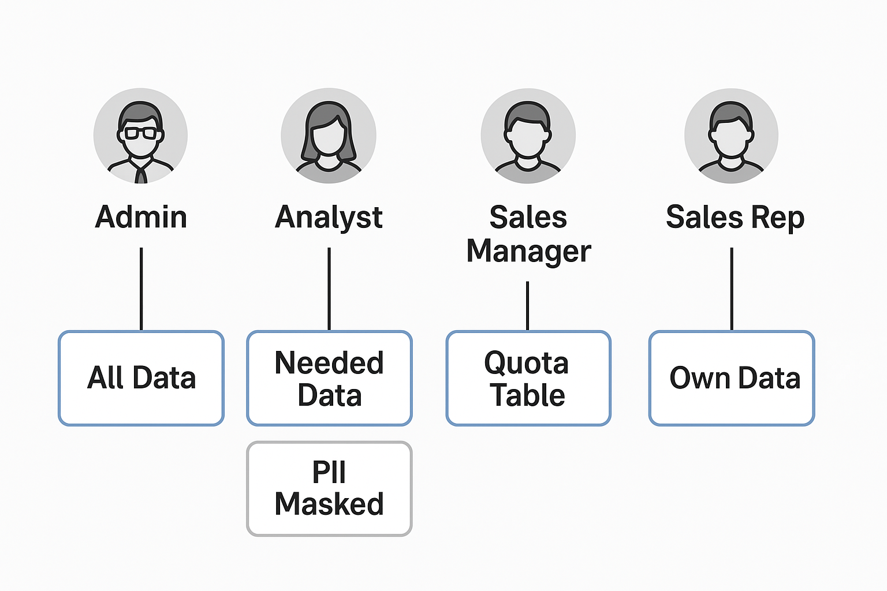

# Data Governance: Implementing Granular Access Control


## Overview & Scenario

This project implements data governance at a granular level by applying features such as Dynamic Data Masking (DDM), Column-Level Security (CLS), and Row-Level Security (RLS) within a business setting.

This is demonstrated using SQL Server but also applies to SQL Endpoints and Data Warehouse on Fabric and Synapse


  <details><summary><b> Business Scenario</b></summary>
Let's say . . .

A business has an Information Governance (IG) policy with data governance at its core, requiring that client and employee PII be safeguarded. An analyst needs historical sales quota data for analysis, but the raw data includes sensitive fields. Meanwhile, the sales manager wants sales reps to only see their own quotas when accessing a specific table.

The management has asked that this exercise adheres the organization's IG.

So, a proposed **Solution** would be to:

- Give stakeholders minimum access by  must following the **principle of least privilege** and regulatory compliance.

- Identify necessary tables so we can restrict or mask PII.

- Use **Column-Level Security (CLS)** and **Dynamic Data Masking(DDM** to hide sensitive fields from analyst.

- Apply **Row-Level Security (RLS)** so sales reps see only their data in a created Sales Quota table; managers and database admin can see all.

- Restrict tables or schemas not needed by the stakeholders with Object-Level Security.

  </details>

## Prerequisite

- Adventure Works database set up on SQL server/ Fabric Data Warehouse, SQL Endpoints/ Synapse. Check [here](https://github.com/adekolaolat/fabric-data-engineering-on-premises-db/blob/main/guides/on-prem-db-setup.md) for set up SQL Server on local machine.
- T-SQL  

## Implementation Steps

- [Set up  on-prem DB and Fabric](https://github.com/adekolaolat/fabric-data-engineering-on-premises-db/blob/main/guides/on-prem-db-setup.md)
  <details><summary>Set up</summary>

  - SQL Server, SSMS
  - Restore AdventureWorks database
  - Enable Remote Connections to SQL Server
  - Set up on-premises DB on machine

  </details>

  - (Optional) [Data pipeline to land data from  on-premises into Fabric lakehouse.](https://github.com/adekolaolat/fabric-data-engineering-on-premises-db/blob/main/guides/data-ingestion.md)

- [Create access (logins) for stakeholders](https://github.com/adekolaolat/granular-data-security-sql-server-fabric/blob/main/docs/create-db-access.md)
- [Dynamic data masking of PII](https://github.com/adekolaolat/granular-data-security-sql-server-fabric/blob/main/docs/mask-pii.md).
- [Grant permissions to required tables for stakeholders: Object-level security and Column-level security](https://github.com/adekolaolat/granular-data-security-sql-server-fabric/blob/main/docs/grant-access.md)
- [Implement row-level security to table](https://github.com/adekolaolat/granular-data-security-sql-server-fabric/blob/main/docs/implement-rls.md).

## Outcome

The permissions have been implemented so that:

- Analyst – Can only see the data they need, and any sensitive personal details are hidden.

- Sales Manager – Can see the quota table for all sales reps.

- Sales Rep – Can only see their sales quota information.
  
Permission to acess any other data can always to any other data can be granted by the admin 




<details><summary>Running this sqlcmd command will set it up </summary>

  ```sqlcmd -S <ServerName> -d master -U <username> -P <password> -i "sql\setup_granular_access.sql"```

  </details>


## Final Thoughts

Granular security features like DDM, CLS, and RLS in on-prem databases and data warehouses are what turn these rules into reality. By controlling exactly who can see what data and how much detail they get, these features help follow governance policies.

In industries like healthcare, where safeguarding patient records is critical; finance, where protecting customer account details is essential; and education, where maintaining the confidentiality of student records is necessary, strong data governance and security measures are absolutely crucial.
